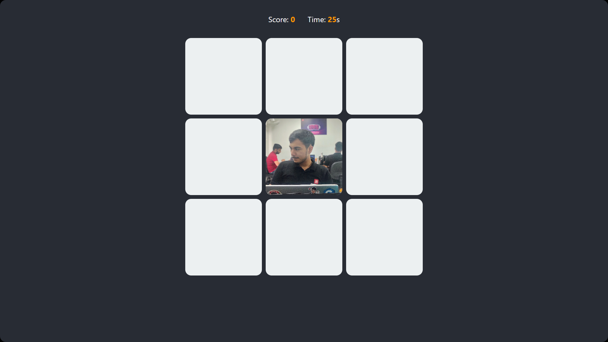

# 🐹 Whack-a-Diven 🎯

A fun and fast-paced JavaScript game where your goal is simple:  
**Whack Diven as fast as you can before time runs out!**

---

<p align="center">
  
</p>

> _“He who hesitates... gets whacked.”_

---
## 🌐 Live Demo

👉 [Play Whack-a-Diven on Netlify](https://whack-a-diven.netlify.app/)
--
## 🎮 How to Play

1. Hit the **Start Game** button.
2. Choose a **difficulty level**: Easy, Medium, or Hard.
3. Moles (a.k.a. Diven 🧑‍🦱) will randomly appear in the 3x3 grid.
4. Click on Diven as quickly as possible to earn points!
5. You have **30 seconds** to score as high as you can.

---

### 🧠 Rules

- ✅ Correct whack: **+1 point**
- ❌ Wrong click: **-1 point**
- ⏱ Time limit: 30 seconds
- 🎖 Reach 30+ to become a **Whack Master**

---

## 📦 Features

- 🧠 Difficulty selection (Easy, Medium, Hard)
- ⏳ Countdown timer
- 📈 Dynamic score updates
- 📱 Mobile-friendly UI
- 💡 Info modal with how-to-play instructions
- 🔄 Game restarts with full-screen support
- 🔥 Mole speed increases every 2 seconds

---

## 🛠 Tech Stack

- **HTML5**  
- **CSS3** (with gradients, modals, and responsive UI)
- **JavaScript** (Vanilla JS – no frameworks!)

---

## 📸 Screenshot

> Live Preview of Game UI

<p align="center">
  
</p>

---

## 🧑‍🎤 Who is Diven?

Diven is our beloved friend who agreed (or maybe not 😅) to become the face of the mole in this game.  
You’ll see his cheerful face popping up all over the board — **but don’t hesitate**. Whack away for points!

<p align="center">
  
</p>

---

## 🚀 Run Locally

1. Clone the repository:
   ```bash
   git clone https://github.com/kartikay-28/Whack-a-Mole-Game
   cd Whack-a-Mole-Game
